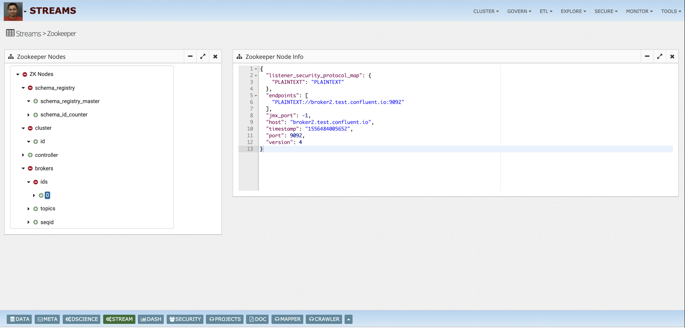

## Zookeeper UI

InsightLake Data Explorer solution is part of InsightLake Data Platform. It provides an intuitive UI and allows users to connect to various data sources and explore the data eaisly.

To learn more, check out [http://insightlake.com/dataexplorer.html](http://insightlake.com/dataexplorer.html)

Installation
------
* Download or clone the repository. 
* Run bin/insightlake command.
* Open browser with URL as http://localhost:8080/
* Change configuration in /conf folder to set different ports
* By default H2 database is used, you can change the database details in jdbc.properties file

## Demo Link
http://insightlake.s3.amazonaws.com/releases/zookeeper/index.html

License
------
InsightLake Data Explorer is a commercial product but distributed to be used freely. Please contact contact@insightlake.com for details.

Getting Help
----------

You can get help easily :
Slack Channel - [Join InsightLake Slack Community](https://join.slack.com/t/insightlake/shared_invite/enQtNzQzMDE3MDI4ODA1LWM2YmI5MDUzODM5ZjQzZjE3ZDk1MjhiNThjMTBkODJjMGU2OWJmOWQ0MDE5NGI4YjYyYjVhZjEzYzY3YzIzMjY)

Twitter - https://twitter.com/InsightLake

Facebook - https://www.facebook.com/insightlake/

Email: contact@insightlake.com

